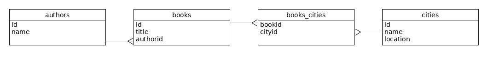

# Database Exam Project

### Group members: Ali Raza Khan, Mohammed Murad Hossain Sarker, Rasmus Balder Nordbjærg, Yakubu Adeyemi Oseni

## Which databases are used?
We used MySQL and mongodb.

## How data is modeled in the database?

We have insert cityname  and location in the citis table and  insert booktitle and authorid in the books table then create relation between books and authors table. We have also create new table name books_cities for create relationship between books and cities table.

## How the data is imported?

### Getting the .txt book files from the Gutenberg Project

We followed the hinted steps creating a VM on DigitalOcean using Vagrant. In the vagrantfile we changed the size of the VM from '1gb' to 's-1vcpu-3gb' because we believed this would better fit our needs.

After for running less than 2 days the script was done and we could download the 5gb archive.tar using scp. Extracting the archive.tar file revealed directory with around 37,000 zipfiles.

### Unzipping the files and putting them into order

We ran below shell commands from the directory of all the zipped files in order to unzip them and thereafter delete the zip files:

    unzip '*.zip'
    rm *.zip

Following commands was used to move files from subfolders to current folder, delete empty folders and show all non-txt files:

	find . -mindepth 2 -type f -print -exec mv {} . \;
	find . -empty -type d -delete
	find -not -iname "*.txt"

Last line gave following ouput. Only few files that aren't .txt:

	./13655.txt.20041109
	./Common-README
	./25438-h.htm
	./001.png
	./17424-mid.mid
	./17424-mus.mus
	./17424-pdf.pdf
	./17421-mid.mid
	./17421-mus.mus
	./17421-pdf.pdf
	./17423-mid.mid
	./17423-mus.mus
	./17423-pdf.pdf
	./17422-mid.mid
	./17422-mus.mus
	./17422-pdf.pdf
	./anxious.jpg
	./christmas.jpg
	./detail.jpg
	./fairy.jpg
	./horse.jpg
	./last.jpg
	./spring.jpg
	./summer.jpg

We deleted all the non-txt files:

	find -not -iname "*.txt" -delete

### Getting author and book title from txt

(see process_books.py)

We used below regular expression patterns to extract the author and the book title from the txt files. 

	re_patterns = [
        "[ ]{0,4}Title: (.+)\n\n[ ]{0,4}Author: ([^\n]+)\n",
        "  We need your donations.\n\n\n([^\n]+)\n\nby ([^\n]+)\n\n",
        "\n\nTitle: (.+)\nAuthor: (.+)\nRelease Date: ",
        "\n\n\n\n\n\n[\d]{4}\n\n()\n\nby ()\n\n\nDramatis Personae",
    ]

By testing with a sample of 1000 txt files we concluded that around 5% of the files would be last with our algorithm. This was due to either text encoding not being utf-8 or our regex was not able to extract the book title and author. We agreed that this was an acceptable loss.

### Using the NLP python library spaCy we extracted all named entities from the books

(see process_books.py)

Using the name entity recognition provided by the spaCy library the entities are divided into types (categories) so we only included entities of type 'GPE' which should include countries, cities and states.

The spaCy library was rather heavy and had a default maximum length of 1,000,000 characters per string. Following the library recommendation we set the max limit to be even lower (ram available * 10,000). Some books exceeded the max length so we cut them into chunks accordingly.

### Uploading the books and their city mentions

(see db_setup.sql)

In the MySQL database we had created a stored procedure to insert a book. Since the books table contains a foreign key column referencing the authors we need to have an author id before the book can be inserted. Therefore we check whether the author exists and if not we insert into the authors table.
When creating the insert_book stored procedure we decided that if 2 books with same title have different authors they must be different books. Should we try to insert a book with same author and title as an existing book our system will recognise it as the same book and therefore not perform the insert statement.

	drop procedure if exists insert_book;
	delimiter $$
	create procedure insert_book(
		in booktitle nvarchar(1000), 
		in authorname nvarchar(100)
	)
	begin
		DECLARE author_id INT default 0;
		DECLARE book_id iNT default 0;
		set @author_id = 0;
		set @book_id = 0;

		select id into @author_id from authors 
			where name = authorname limit 1;

		if @author_id is null or @author_id = 0 then
			insert into authors(name) values (authorname);
			set @author_id = LAST_INSERT_ID();
		end if;

		select id into @book_id from books 
			where authorid = @author_id 
			and title = booktitle
			limit 1;

		if @book_id is null or @book_id = 0 then
			insert into books(title, authorid) 
				values (booktitle, @author_id);
			set @book_id = LAST_INSERT_ID();
		end if;
		select @book_id;
	end$$
	delimiter ;

 
 
Behavior of query test set. Including a discussion on how much of the query runtime is influenced by the DB and what is influenced by the application frontend.
·        
Your recommendation, for which database to use in such a project for production.
·      MySQL is highly organized for its flexibility, high performance, reliable data protection, and ease of managing data. Proper data indexing can resolve your issue with performance, facilitate interaction and ensure robustness.
·      But if your data is not structured and complex to handle, or if predefining your schema is not coming easy for you, you should better opt for MongoDB. What’s more, if you're required to handle a large volume of data and store it as documents, MongoDB will help you a lot!
·      The result of two database  One isn’t necessarily better than the other. MongoDB and MySQL both serve in different niches.
·      But we prefer  for this solution mongodb.
                     
 

